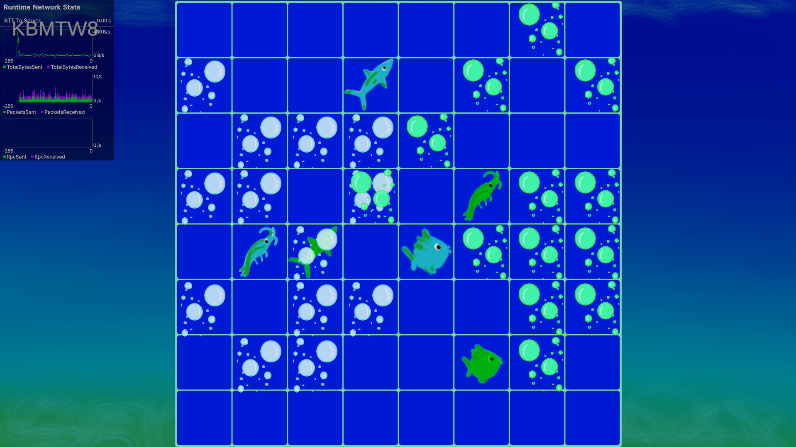

# Sharks and Shrimps
This is a mulyiplayer game where each player controls a team of animals consisting of a Shark, a Fish and a Shrimp, and a team who has more animals escaped the field wins.

[**Full Rules🐟**](#full-rules)

## Progress 
**2 player version is fully developed with few bugs left to fix**

### **Working on**
- Fixing the ability of a player to press `escape` button for the opposite team
- Fixing the lack of escape button when the last animal is coming the edge of the field
- Fixing the inability of starting a new game without reopening

### **Future Plans**
- Add more than 2 player versions

 🦈 🐠 🦐

### **Full Rules** 
Each player moves a animal of their team one square at a time in the order `Shark -> Fish -> Shrimp`, taking turns with the opponent between each animal. Each animal must defeat their target animal in the opponent team. Shark eats Fish, Fish eats Shrimp and Shrimp tickles Shark. Animals cannot move to the square where them or another animal from the same team has already been. If an animal has no squares they can move to they become trapped and exit the game. An animal can escape the fiels if they already defeated their target animal in the opposite team or the traget animal became trapped or escaped the field. Ones all available animals escape, the team who has more animals left wins.

🌊🌊🌊
>